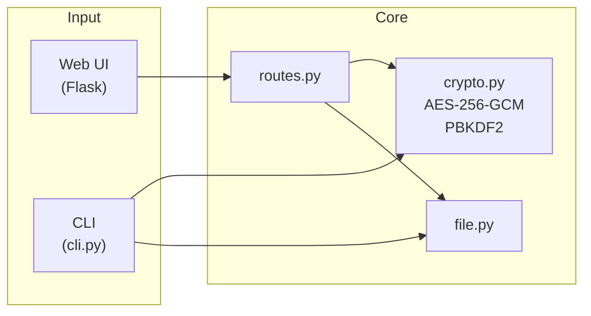
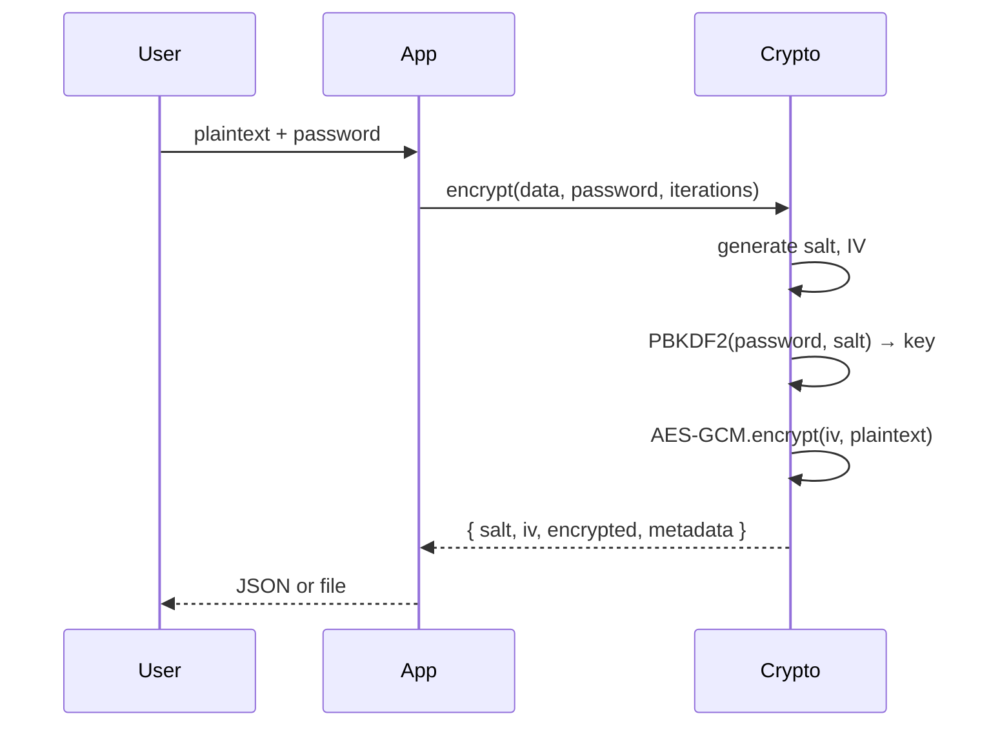

## Encrypt & decrypt

### Secure local encryption and decryption of sensitive data using AES-256-GCM with web and CLI interfaces.


## Table of Contents

- [Overview](#overview)
- [Tech Stack](#tech-stack)
- [Architecture](#architecture)
- [Project Structure](#project-structure)
- [Getting Started](#getting-started)
- [Running the App](#running-the-app)
- [Available Scripts](#available-scripts)
- [Key Features](#key-features)
- [Testing](#testing)
- [Security](#security)
- [Contributing](#contributing)
- [License](#license)

## Overview

**What it does** — encrypt_decrypt is a local-first tool for encrypting and decrypting sensitive text and files. It provides a Flask web UI and a CLI for automation. All processing happens locally; no data is stored or transmitted over the network.

**Why it exists** — to offer a simple, auditable way to protect secrets (passwords, API keys, config snippets) using strong, standards-based cryptography. Suitable for personal use, scripts, and small teams.

**Current status** — production-ready. Web and CLI interfaces implemented. Test suite covers crypto, validation, file handling, and routes. CI runs on Python 3.10–3.12.

## Tech Stack

| Layer        | Technology                                 |
| ------------ | ------------------------------------------ |
| Language     | Python 3.10+                               |
| Web          | Flask 2.3, Flask-WTF (CSRF), Flask-Limiter |
| Cryptography | cryptography 43.x (AES-256-GCM, PBKDF2)    |
| CLI          | argparse, Click (via setup.py entry)       |
| Config       | python-dotenv, config classes              |
| Testing      | pytest 7.4                                 |
| Linting      | Ruff (pyproject.toml)                      |
| Package      | setuptools, pip                            |

## Architecture

The app exposes two interfaces (web and CLI) that share the same crypto and file utilities. Encryption uses AES-256-GCM with PBKDF2-SHA256 key derivation. Output is a JSON envelope with salt, IV, ciphertext, and metadata.

### System Overview



### Encryption Flow



## Project Structure

```
encrypt_decrypt/
├── app/
│   ├── __init__.py          # Flask app factory, security headers
│   ├── extensions.py       # CSRF, rate limiter
│   ├── routes.py            # Web routes (encrypt, decrypt)
│   ├── utils/
│   │   ├── crypto.py        # AES-256-GCM, PBKDF2
│   │   ├── file.py          # Load/save encrypted JSON
│   │   ├── validation.py   # Input validation
│   │   └── errors.py       # Error handling
│   ├── static/              # CSS, JS
│   └── templates/           # Jinja2 (index.html)
├── tests/
│   ├── conftest.py          # Pytest fixtures
│   ├── test_routes.py       # Route integration tests
│   └── unit/                # Unit tests (crypto, file, validation)
├── scripts/                 # Utility scripts (e.g. setup.sh)
├── config.py                # Config classes (dev, test, prod)
├── run.py                   # Web entry point
├── cli.py                   # CLI entry point
├── setup.py                 # Package install, encrypt-decrypt entry
├── Makefile                 # setup, run, test, clean, install
├── pyproject.toml           # Ruff, pytest config
└── requirements.txt         # Dependencies
```

## Getting Started

### Prerequisites

- **Python** >= 3.10
- **pip** (or `make setup` for venv)

### Installation

```bash
git clone https://github.com/ErikKopcha/crypto-vault.git
cd crypto-vault
python3 -m venv venv
source venv/bin/activate   # Windows: venv\Scripts\activate
pip install -r requirements.txt
```

Or use the setup script (creates venv, installs deps, copies `.env.example` to `.env`):

```bash
./scripts/setup.sh
```

Optional — install as a package (provides `encrypt-decrypt` command):

```bash
pip install -e .
```

### Environment Setup

| Variable     | Description                            | Required                        |
| ------------ | -------------------------------------- | ------------------------------- |
| `FLASK_ENV`  | `development`, `testing`, `production` | optional (default: development) |
| `SECRET_KEY` | Flask secret (required in production)  | ✅ (prod)                       |
| `HOST`       | Bind host (default: `0.0.0.0`)         | optional                        |
| `PORT`       | Bind port (default: `5000`)            | optional                        |

> **Security note:** In production, set `SECRET_KEY` to a strong random value:
>
> ```bash
> openssl rand -base64 32
> ```

## Running the App

```bash
# Web (development)
python run.py
# or
make run
```

Open [http://localhost:5000](http://localhost:5000) in your browser.

```bash
# CLI
python cli.py encrypt "Your secret message" "your-password"
python cli.py decrypt encrypted/encrypted_2024-05-23_15-30-12.json "your-password"

# With secure password prompt
python cli.py encrypt "Your secret" --prompt
python cli.py decrypt encrypted/file.json --prompt

# If installed as package
encrypt-decrypt encrypt "Your secret" "your-password"
encrypt-decrypt decrypt encrypted/file.json "your-password"
```

## Available Scripts

| Command                                  | Description                           |
| ---------------------------------------- | ------------------------------------- |
| `make setup`                             | Create venv and install dependencies  |
| `make run`                               | Start Flask dev server                |
| `make test`                              | Run pytest with verbose output        |
| `make lint`                              | Run Ruff linter                       |
| `make clean`                             | Remove `__pycache__` and `.pyc` files |
| `make install`                           | Install package in development mode   |
| `make encrypt data="..." password="..."` | CLI encrypt via Makefile              |
| `make decrypt file="..." password="..."` | CLI decrypt via Makefile              |

## Key Features

- **AES-256-GCM** — authenticated encryption
- **PBKDF2-SHA256** — key derivation (default 100,000 iterations, configurable 1K–1M)
- **Web UI** — encrypt/decrypt via browser, paste or upload
- **CLI** — scriptable, supports `--prompt` for secure password input
- **Local-only** — no data stored or sent over the network
- **JSON envelope** — portable format with salt, IV, metadata

## Testing

```bash
FLASK_ENV=testing pytest tests/ -v
# or
make test
```

Tests cover:

- Unit: crypto, file I/O, validation, error handling
- Integration: web routes (encrypt, decrypt)

CI runs on Python 3.10, 3.11, 3.12.

## Security

### Cryptography

- **AES-256-GCM** — authenticated encryption for confidentiality and integrity
- **PBKDF2-HMAC-SHA256** — key derivation (1,000–1,000,000 iterations, default 100K)
- **Random salt and IV** per encryption operation
- **Iterations bounds** enforced on decrypt to prevent PBKDF2 DoS

### Web Security

- **CSRF protection** — Flask-WTF on all POST forms
- **Security headers** — X-Content-Type-Options, X-Frame-Options, CSP, Referrer-Policy
- **Input limits** — 1 MB for data/encrypted JSON, 256 chars for password
- **Rate limiting** — 120 requests/minute per IP (Flask-Limiter)
- **File upload limit** — 10 MB

### Operational

- No logging of plaintext or passwords
- `SECRET_KEY` required in production
- `.env.example` for configuration template

> This tool is for legitimate security use. Use encryption responsibly and in compliance with applicable laws.

## License

[MIT](LICENSE) © 2026 Erik K.
